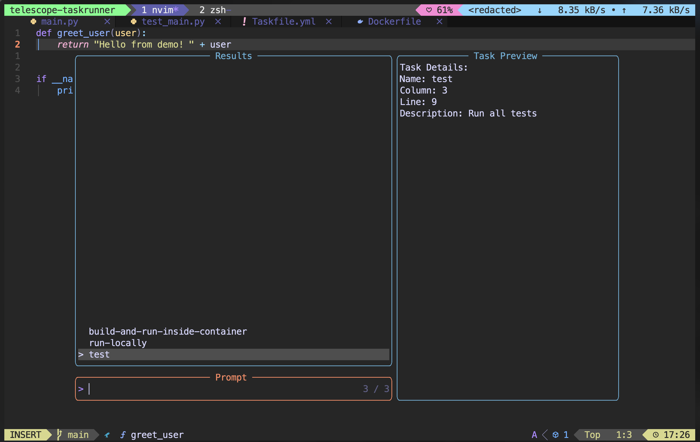

# telescope-taskrunner.nvim

A Neovim plugin that seamlessly integrates Telescope, Taskfile, and tmux to provide an intuitive task runner interface directly from your editor.

## 🚀 Why telescope-taskrunner.nvim?

We as developers, DevOps engineers, sys admins, and engineers - we often build programs, scripts, and tools that do something meaningful. At the end of the day, we write programs to solve people's problems with programs.

**The Problem I Faced:**
When I'm working on big projects, I often need to switch between terminals to check program outputs. This constant context switching was driving me crazy! I found myself:
- Losing focus while jumping between multiple terminal windows
- Forgetting which commands I needed to run for different stages
- Manually typing the same complex command sequences over and over
- Wasting time navigating through terminal history

**My Solution Journey:**
I discovered that combining these powerful technologies could solve my workflow frustrations:

- **tmux** solves the problem of creating panes and splitting panes instead of creating new terminals
- **Taskfile** (a modern Makefile) solves the problem of combining sets of commands into stages. Instead of remembering multiple commands, I can create stages like `build`, `test`, `deploy` by grouping commands and execute them with `task build`, `task test`, `task deploy`
- **Telescope** brings the intuitive Neovim way of finding and selecting things

This plugin takes me to an even more intuitive Neovim way of combining all these powerful technologies into the sweet Neovim spot.

## ✨ Features

- **Efficient Task Management**: Discover and manage tasks effortlessly with Telescope
- **Quick Execution**: Start tasks instantly, supported by tmux integration for labeled panes
- **Task Monitoring**: Track task usage and sort dynamically based on frequency

## 📦 Installation

### Using [lazy.nvim](https://github.com/folke/lazy.nvim)

```lua
{
  "Naga-ganesh/telescope-taskrunner.nvim",
  dependencies = { "nvim-telescope/telescope.nvim" },
  config = function()
    -- Setup keymaps
    vim.keymap.set("n", "<leader>t", function()
      require("telescope-taskrunner").show_available_tasks()
    end, { noremap = true, silent = true, desc = "Show Available Tasks" })

    vim.keymap.set("n", "<leader>r", function()
      require("telescope-taskrunner").execute_recent_task()
    end, { noremap = true, silent = true, desc = "Execute Recent Task" })
  end,
}
```

### Using [packer.nvim](https://github.com/wbthomason/packer.nvim)

```lua
use {
  'Naga-ganesh/telescope-taskrunner.nvim',
  requires = { 'nvim-telescope/telescope.nvim' },
  config = function()
    -- Setup keymaps (same as above)
  end
}
```

### Using [vim-plug](https://github.com/junegunn/vim-plug)

```vim
Plug 'nvim-telescope/telescope.nvim'
Plug 'Naga-ganesh/telescope-taskrunner.nvim'
```

## 🛠️ Prerequisites

- **Neovim** >= 0.7.0 ([Installation Guide](https://neovim.io/))
- **Telescope.nvim**
- **tmux** (for terminal multiplexing) ([Installation Guide](https://github.com/tmux/tmux/wiki/Installing))
- **Taskfile** ([Installation Guide](https://taskfile.dev/docs/installation))

## 📋 Usage

### Setting up Taskfile

Create a `Taskfile.yml` in your project root:

```yaml
version: '3'

tasks:
  build:
    desc: Build the application
    cmds:
      # sleep for 5 seconds to simulate a long-running task
      - echo 'building the application...'
      - sleep 5
      - echo 'application built successfully'

  test:
    desc: Run all tests
    cmds:
      # sleep for 5 seconds to simulate a long-running task
      - echo 'running tests...'
      - sleep 5
      - echo 'tests completed successfully'

  deploy:
    desc: Deploy to production
    cmds:
      # sleep for 5 seconds to simulate a long-running task
      - echo 'deploying to production...'
      - sleep 5 # Of course, deployment wouldn't take 5 seconds; at least we would expect it to take some time here for demonstration.
      - echo 'deployment completed successfully'

```

### Plugin Functions

#### `show_available_tasks()`
As the name says it all - this opens a Telescope picker with all your available tasks. When you select a task and hit Enter, the plugin creates a new tmux pane with the name of the stage and runs the task. When the task completes, it automatically closes the pane - neat and clean, isn't it?

**Features:**
- **Telescope picker** with fuzzy search through task names
- **Preview pane** shows task details (name, description, location)
- **Smart ranking mechanism** - tasks you've executed the most appear first
- **One-click execution** in dedicated tmux panes

#### `execute_recent_task()`
Again, the function name says it all! Most of the time, we don't want to open the telescope picker and type fuzzy find words just to execute the task we ran last time. This function solves that problem - it tracks the last executed task and runs it when you call the function.

### 📹 Video Demonstration

[For a visual walkthrough of how the plugin works, please refer to the video.](https://www.youtube.com/watch?v=UJG79VC80Ik)

[](https://www.youtube.com/watch?v=UJG79VC80Ik)

**Perfect for:**
- Iterative development workflows
- Quick re-runs without the picker interface
- Maintaining flow state during development

## ⌨️ Default Keymaps

| Key | Function | Description |
|-----|----------|-------------|
| `<leader>t` | `show_available_tasks()` | Open task picker |
| `<leader>r` | `execute_recent_task()` | Run last task |

## 🎨 Workflow Example

1. **Setup**: Create your `Taskfile.yml` with build, test, deploy stages
2. **Discover**: Press `<leader>t` to see all available tasks
3. **Execute**: Select a task and press Enter - it runs in a dedicated tmux pane
4. **Iterate**: Use `<leader>r` to quickly re-run the same task
5. **Efficiency**: Watch as your most-used tasks bubble to the top of the list

## 🔧 Configuration

The plugin works out of the box with sensible defaults. Task usage data is automatically stored in:
```
~/.local/share/nvim/task_usage.json
```

## 🙏 Acknowledgments

- [Telescope.nvim](https://github.com/nvim-telescope/telescope.nvim)
- [Taskfile](https://taskfile.dev/)
- [tmux](https://github.com/tmux/tmux)
